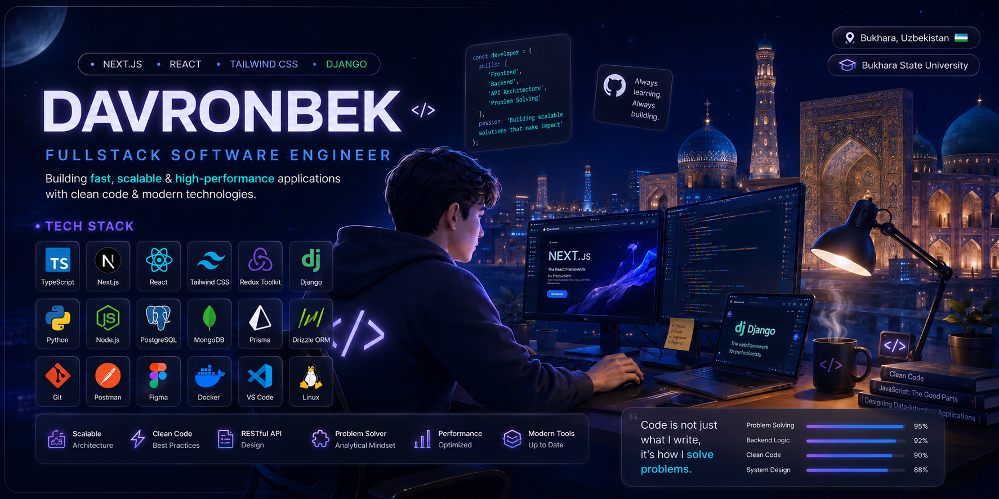

<div align="center">

  

  <br />

  

  <br />
  <br />

  <a href="https://davron-dev.uz/">
    
  </a>

  <a href="https://linkedin.com/in/davron-aslonov-fullstack">
    
  </a>

  <a href="https://upwork.com/freelancers/~01996452c56ea685c0">
    
  </a>

  <a href="https://t.me/Aslonov_Davronbek">
    
  </a>

  <br />
  <br />

  

</div>

---

# 👋 Hi, I'm Davronbek Aslonov

### Fullstack Software Engineer from Bukhara 🇺🇿

I am a passionate **Fullstack Software Engineer** focused on building fast, scalable, maintainable, and user-friendly web applications.

I enjoy combining modern frontend technologies, reliable backend systems, RESTful APIs, database architecture, and clean code to build production-ready software.

```text
Frontend       → Next.js • React • TypeScript • Tailwind CSS
Backend        → Python • Django • Django REST Framework • Node.js
Databases      → PostgreSQL • MongoDB
ORM            → Prisma • Drizzle
Architecture   → REST APIs • Clean Architecture • Scalable Systems
Tools          → Git • GitHub • Postman • Figma • Docker
Current Focus  → AI Integration • Backend Engineering • System Design
